# inventario-app

Catálogo de inventario con interfaz web y base de datos local. Este repositorio es el **punto de partida** de la tarea de CI/CD — no incluye `Dockerfile`, workflow de GitHub Actions ni manifiestos de Kubernetes: esos tres se construyen como parte del trabajo asignado.

## Qué es

Una app Node.js/Express con:

- **Interfaz web** (`public/index.html`, `public/app.js`, `public/styles.css`): una tabla de productos con formulario para agregar y botón para eliminar.
- **Base de datos local** (`db.js`): un archivo JSON en `data/products.json` que persiste los productos entre reinicios del proceso — sin motor de base de datos externo ni dependencias nativas.
- **API REST** consumida por la interfaz.

## Ejecutar en local

```bash
npm install
npm start
# abrir http://localhost:3000
```

## Pruebas

```bash
npm test
```

## Endpoints

| Método y ruta | Qué hace |
|---|---|
| `GET /health` | Estado de salud: `200` si el proceso y el archivo de base de datos son accesibles, `500` si no (o si `SIMULATE_FAILURE=true`). |
| `GET /version` | Devuelve `version`, `color` y `hostname` — configurables por variables de entorno `APP_VERSION` / `APP_COLOR`. |
| `GET /api/products` | Lista todos los productos. |
| `GET /api/products/:id` | Devuelve un producto por id. |
| `POST /api/products` | Crea un producto (`name`, `sku`, `stock`, `price`). |
| `PATCH /api/products/:id` | Actualiza campos de un producto. |
| `DELETE /api/products/:id` | Elimina un producto. |
| `GET /` | Sirve la interfaz web. |

## Variables de entorno

| Variable | Por defecto | Para qué |
|---|---|---|
| `PORT` | `3000` | Puerto del servidor. |
| `APP_VERSION` | `v1` | Se muestra en `/version` y en el encabezado de la interfaz. |
| `APP_COLOR` | `blue` | Color del encabezado — útil para distinguir versiones en un despliegue. |
| `SIMULATE_FAILURE` | `false` | Si es `true`, `/health` responde siempre `500`. |
| `DB_PATH` | `./data/products.json` | Ruta del archivo de base de datos local. |

# Guía de reproducción
# Link Repo
https://github.com/Alanissette16/practica_cicd.git

## Paso 1. Ejecutar y probar la aplicación localmente

Instalar exactamente las dependencias registradas en `package-lock.json`:

```powershell
npm ci
```

`npm ci` permite reproducir las mismas versiones de dependencias en el equipo local y en GitHub Actions.

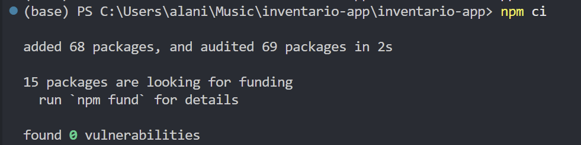

*Evidencia: las dependencias se instalaron correctamente con `npm ci`.*

Ejecutar las pruebas:

```powershell
npm test
```

Las cinco pruebas deben terminar aprobadas.

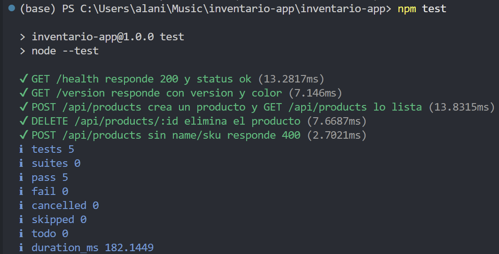

*Evidencia: las pruebas verifican `/health`, `/version` y las operaciones principales del catálogo.*

Iniciar el servidor:

```powershell
npm start
```

Abrir en el navegador:

```text
http://localhost:3000
```

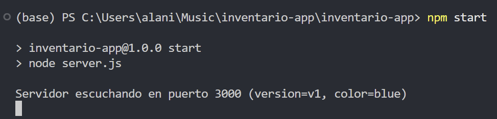

*Evidencia: Express está escuchando en el puerto configurado.*

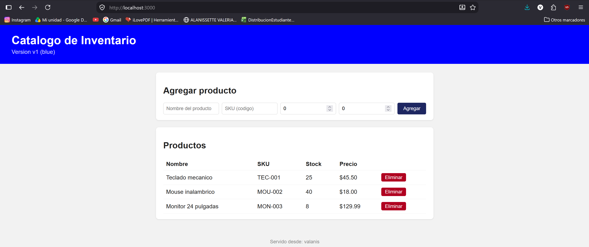

*Evidencia: la interfaz permite consultar y administrar productos.*

---

## Paso 2. Construir y probar la imagen Docker

### Dockerfile multi-stage

El `Dockerfile` contiene dos etapas:

1. `test`: instala todas las dependencias y detiene el build si `npm test` falla.
2. `runtime`: contiene únicamente lo necesario para ejecutar la aplicación.

```dockerfile
FROM node:22-alpine AS test
WORKDIR /app
COPY package*.json ./
RUN npm ci
COPY . .
RUN npm test

FROM node:22-alpine AS runtime
WORKDIR /app
ENV NODE_ENV=production
ENV PORT=3000
COPY package*.json ./
RUN npm ci --omit=dev && npm cache clean --force
COPY server.js ./
COPY db.js ./
COPY public ./public
RUN mkdir -p /app/data \
    && chown -R node:node /app
USER node
EXPOSE 3000
CMD ["node", "server.js"]
```

La eliminación de `npm` y `npx` ocurre después de instalar las dependencias de producción. La aplicación continúa funcionando porque se inicia directamente con `node server.js`.

### `.dockerignore`

```dockerignore
node_modules
npm-debug.log*
.git
.github
k8s
.DS_Store
data/*.json
!data/.gitkeep
```

Este archivo reduce el contexto de construcción y evita copiar archivos locales innecesarios dentro de la imagen.

### Construcción local

```powershell
docker build -t inventario-app:local .
```

El punto final indica que Docker debe usar la carpeta actual como contexto del build.

Comprobar la imagen:

```powershell
docker images inventario-app
```

Ejecutar el contenedor:

```powershell
docker run -p 3000:3000 inventario-app:local
```

En otra terminal, verificar las rutas:

```powershell
curl.exe -s http://localhost:3000/ | Select-String "<title>"
curl.exe -s http://localhost:3000/health
curl.exe -s http://localhost:3000/version
curl.exe -s http://localhost:3000/api/products
```

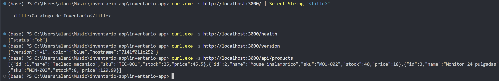

*Evidencia: la imagen construida localmente responde en las cuatro rutas solicitadas.*

Detener el contenedor con `Ctrl + C`.

---

## Paso 3. Pipeline CI/CD y publicación en GHCR

El workflow se encuentra en:

```text
.github/workflows/ci-cd.yml
```

El pipeline sigue el principio fail-fast:

```text
build-test
    ↓ solo si termina correctamente
build-push
    ↓
construcción local de la imagen
    ↓
escaneo con Trivy
    ↓ solo si no hay vulnerabilidades CRITICAL
publicación en GHCR
```

### Workflow final

```yaml
name: ci-cd

on:
  push:
    branches: [main]

env:
  REGISTRY: ghcr.io
  IMAGE_NAME: alanissette16/practica_cicd

jobs:
  build-test:
    runs-on: ubuntu-latest

    steps:
      - uses: actions/checkout@v4

      - uses: actions/setup-node@v4
        with:
          node-version: '22'

      - name: Instalar dependencias
        run: npm ci

      - name: Ejecutar pruebas
        run: npm test

  build-push:
    needs: build-test
    runs-on: ubuntu-latest

    permissions:
      contents: read
      packages: write

    steps:
      - uses: actions/checkout@v4

      - name: Login en GitHub Container Registry
        uses: docker/login-action@v3
        with:
          registry: ${{ env.REGISTRY }}
          username: ${{ github.actor }}
          password: ${{ secrets.GITHUB_TOKEN }}

      - name: Build y push de la imagen (build once, promote many)
        uses: docker/build-push-action@v6
        with:
          context: .
          push: true
          tags: |
            ${{ env.REGISTRY }}/${{ env.IMAGE_NAME }}:${{ github.sha }}
            ${{ env.REGISTRY }}/${{ env.IMAGE_NAME }}:latest
```

`needs: build-test` evita construir y publicar una imagen cuando las pruebas fallan.  

### Activar el pipeline

```powershell
git add .
git commit -m "pipeline corregiddo"
git push origin main
```

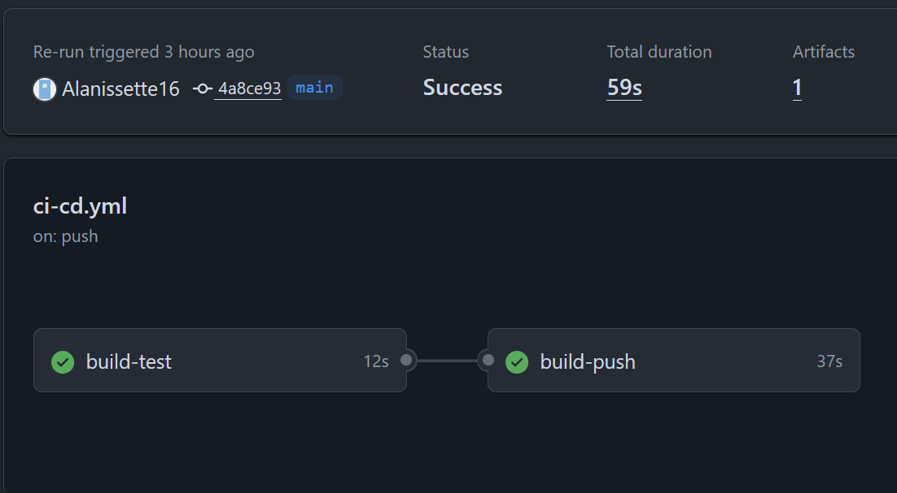

*Evidencia: `build-test` y `build-push` finalizaron correctamente.*

### Verificar la imagen publicada

```powershell
$SHA = git rev-parse HEAD
docker pull "ghcr.io/alanissette16/practica_cicd:$SHA"
docker pull ghcr.io/alanissette16/practica_cicd:latest
```

El primer comando valida la etiqueta inmutable del commit. El segundo valida la etiqueta `latest`.

---

## Paso 4. Desplegar con Rolling Update en Minikube

Los manifiestos base se encuentran en:

```text
k8s/deployment.yaml
k8s/service.yaml
```
**k8s/deployment.yaml**

```yaml
apiVersion: apps/v1
kind: Deployment
metadata:
  name: cicd-practica-sd
  labels:
    app: cicd-practica-sd
spec:
  replicas: 4
  strategy:
    type: RollingUpdate
    rollingUpdate:
      maxUnavailable: 1
      maxSurge: 1
  selector:
    matchLabels:
      app: cicd-practica-sd
  template:
    metadata:
      labels:
        app: cicd-practica-sd
    spec:
      containers:
        - name: app
          image: ghcr.io/alanissette16/practica_cicd:latest
          ports:
            - containerPort: 3000
          env:
            - name: PORT
              value: "3000"
          readinessProbe:
            httpGet:
              path: /health
              port: 3000
            initialDelaySeconds: 2
            periodSeconds: 3
            failureThreshold: 3
          livenessProbe:
            httpGet:
              path: /health
              port: 3000
            initialDelaySeconds: 5
            periodSeconds: 10
          resources:
            requests:
              cpu: "50m"
              memory: "64Mi"
            limits:
              cpu: "200m"
              memory: "128Mi"
```

- `replicas: 4` mantiene cuatro instancias de la aplicación.
- `maxUnavailable: 1` permite que como máximo una réplica quede no disponible durante la actualización.
- `maxSurge: 1` permite crear como máximo un pod adicional durante el cambio.

**k8s/service.yaml**
```yaml
apiVersion: v1
kind: Service
metadata:
  name: cicd-practica-sd
spec:
  type: NodePort
  selector:
    app: cicd-practica-sd
  ports:
    - port: 80
      targetPort: 3000
```
### Iniciar el clúster

```powershell
minikube start --driver=docker
minikube status
kubectl get nodes
```

### Aplicar los manifiestos

```powershell
kubectl apply -f k8s/deployment.yaml
kubectl apply -f k8s/service.yaml
```

### Verificar el rollout

```powershell
kubectl rollout status deployment/cicd-practica-sd
kubectl get deployments
kubectl get pods
```

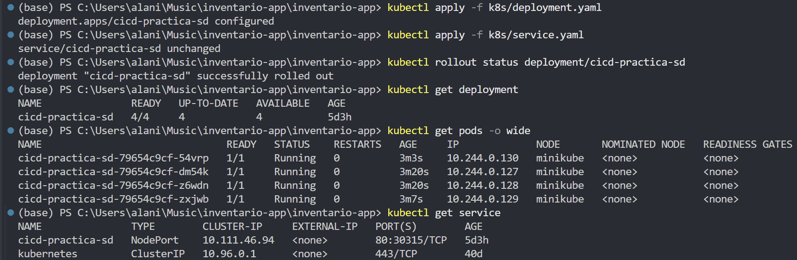

*Evidencia: Kubernetes terminó el despliegue y mantuvo las réplicas disponibles.*

### Consultar el servicio

```powershell
minikube service cicd-practica-sd --url
```

El comando debe mantenerse abierto en Windows cuando Minikube utiliza el driver Docker.

En otra terminal:

```powershell
curl.exe http://127.0.0.1:PUERTO/health
curl.exe http://127.0.0.1:PUERTO/version
```

Reemplazar `PUERTO` por el valor entregado por Minikube.

---

## Paso 5. Probar la persistencia al eliminar un pod

La aplicación utiliza un archivo JSON dentro del sistema de archivos de cada pod. Para realizar una prueba controlada, se debe acceder a un pod específico.

### Seleccionar un pod

```powershell
$POD = kubectl get pods -l app=cicd-practica-sd -o jsonpath="{.items[0].metadata.name}"
Write-Host $POD
```

### Acceder directamente al pod

```powershell
kubectl port-forward "pod/$POD" 3001:3000
```

Abrir:

```text
http://localhost:3001
```

Crear un producto desde la interfaz y verificar el archivo dentro del pod:

```powershell
kubectl exec $POD -- cat /app/data/products.json
```


*Evidencia: se seleccionó un pod concreto para evitar que el Service distribuya la prueba entre réplicas diferentes.*

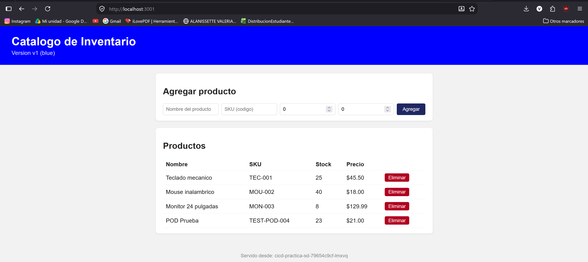
*Evidencia: el producto existe en la interfaz atendida por ese pod.*

### Eliminar el pod

```powershell
kubectl delete pod $POD
kubectl get pods -w
```

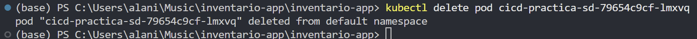

*Evidencia: Kubernetes elimina el pod seleccionado.*

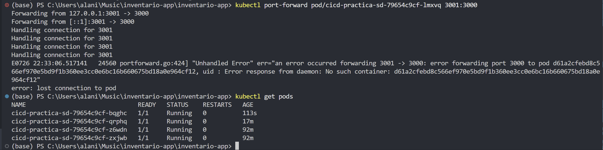

*Evidencia: el Deployment recupera automáticamente la cantidad deseada de réplicas.*

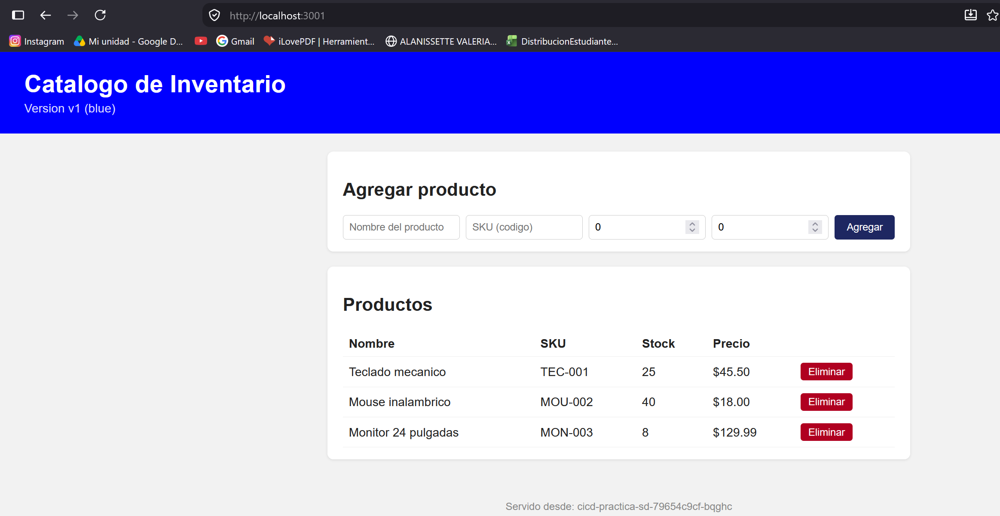

*Resultado observado: el producto desaparece porque la aplicación utiliza una base de datos local dentro de cada contenedor. Al eliminar el pod, también desaparece su archivo local.*

Esta pérdida de información es esperada en la práctica. Para conservar los datos se necesitaría un volumen persistente o una base de datos externa.

---

## Paso 6. Estrategia elegida: Blue-Green

Se eligió Blue-Green porque permite mantener dos grupos independientes:

```text
Blue  → versión actual y estable
Green → versión nueva que se quiere probar
```

Un único Service dirige el tráfico al grupo indicado por su selector. El cambio es rápido y el rollback consiste en regresar el selector al color anterior.

Esta estrategia es adecuada para la aplicación porque facilita demostrar el cambio mediante `/version`. Además, evita mezclar tráfico entre dos grupos durante la prueba, algo importante porque cada pod mantiene un archivo JSON local independiente.

---

## Pasos 7 y 8. Implementar y demostrar Blue-Green

Los manifiestos se encuentran en:

```text
k8s/blue-green/blue-deployment.yaml
k8s/blue-green/green-deployment.yaml
k8s/blue-green/service.yaml
```

Los dos Deployments usan las etiquetas:

```yaml
app: cicd-practica-sd-bg
track: blue
```

o:

```yaml
app: cicd-practica-sd-bg
track: green
```

El Service selecciona inicialmente:

```yaml
selector:
  app: cicd-practica-sd-bg
  track: blue
```

### Verificar las imágenes

```powershell
$BLUE_IMAGE = kubectl get deployment cicd-practica-sd-blue -o jsonpath="{.spec.template.spec.containers[0].image}"
$GREEN_IMAGE = kubectl get deployment cicd-practica-sd-green -o jsonpath="{.spec.template.spec.containers[0].image}"

Write-Host "BLUE:  $BLUE_IMAGE"
Write-Host "GREEN: $GREEN_IMAGE"

docker pull $BLUE_IMAGE
docker pull $GREEN_IMAGE
```

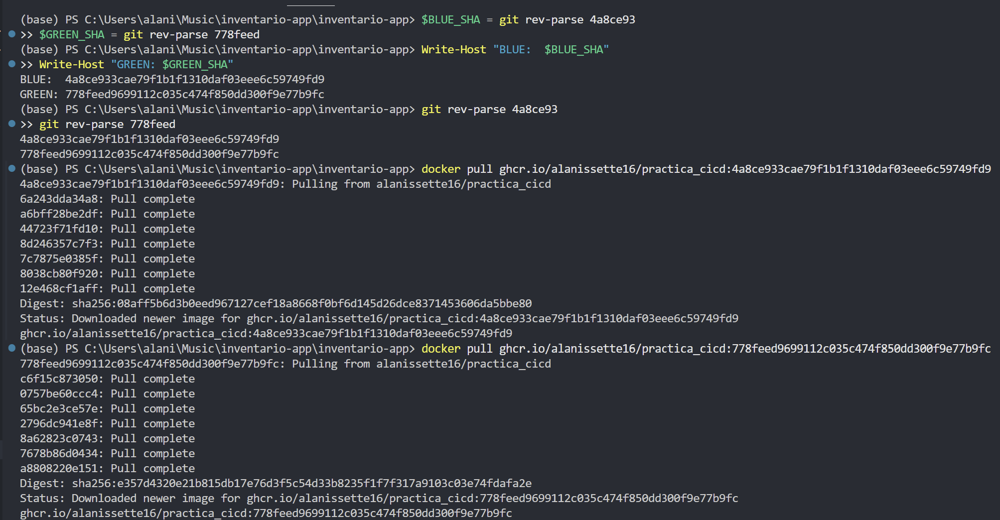

*Evidencia: las imágenes utilizadas por ambos Deployments existen en GHCR.*

### Validar y aplicar

```powershell
kubectl apply --dry-run=client -f k8s/blue-green/
kubectl apply -f k8s/blue-green/
```

### Verificar los Deployments

```powershell
kubectl rollout status deployment/cicd-practica-sd-blue
kubectl rollout status deployment/cicd-practica-sd-green
kubectl get deployments cicd-practica-sd-blue cicd-practica-sd-green
kubectl get pods -l app=cicd-practica-sd-bg -L track
```

Deben existir dos pods Blue y dos pods Green en estado `1/1 Running`.

### Evidencia antes del corte

Comprobar el selector:

```powershell
kubectl get service cicd-practica-sd-bg -o jsonpath="{.spec.selector}"
Write-Host ""
```

Debe mostrar `track: blue`.

Obtener la URL:

```powershell
minikube service cicd-practica-sd-bg --url
```

En otra terminal:

```powershell
curl.exe http://127.0.0.1:PUERTO/version
```

La respuesta debe contener:

```json
{"version":"v1","color":"blue","hostname":"..."}
```

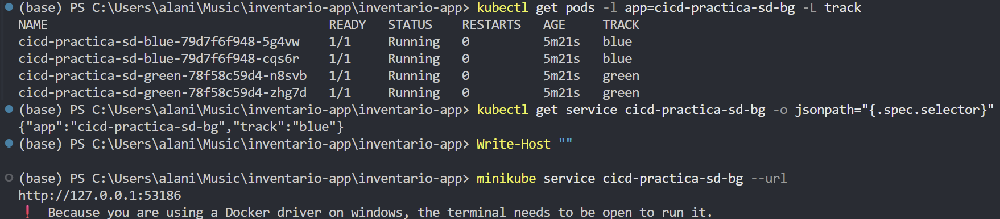

*Evidencia de `kubectl`: el Service selecciona los pods Blue.*

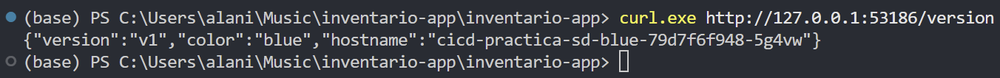

*Evidencia de `curl`: el tráfico llega a la versión `v1`, color `blue`.*

### Cambiar el tráfico a Green

En PowerShell se utiliza un archivo temporal para evitar problemas con las comillas del JSON:

```powershell
'{"spec":{"selector":{"track":"green"}}}' |
  Out-File patch.json -Encoding utf8

kubectl patch service cicd-practica-sd-bg `
  --type=merge `
  --patch-file patch.json

Remove-Item patch.json
```

Verificar el selector:

```powershell
kubectl get service cicd-practica-sd-bg -o jsonpath="{.spec.selector}"
Write-Host ""
```

Consultar la misma URL:

```powershell
curl.exe http://127.0.0.1:PUERTO/version
```

La respuesta debe contener:

```json
{"version":"v2","color":"green","hostname":"..."}
```

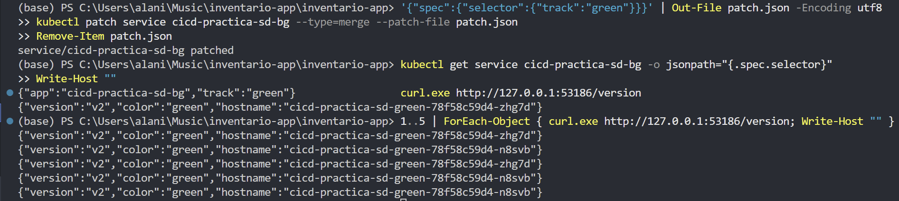

*Evidencia de `kubectl`: el selector cambió a `track: green`.*

> Evidencia necesaria para la entrega: la captura posterior al cambio también debe mostrar un `curl` con `"version":"v2"` y `"color":"green"`.

### Rollback a Blue

```powershell
'{"spec":{"selector":{"track":"blue"}}}' |
  Out-File patch.json -Encoding utf8

kubectl patch service cicd-practica-sd-bg `
  --type=merge `
  --patch-file patch.json

Remove-Item patch.json
```

El rollback no elimina los Deployments. Solo vuelve a dirigir el tráfico a los pods Blue.

---

# Componentes adicionales

Se implementaron los tres componentes solicitados.

## Componente 1. Manejo de secretos

La credencial ficticia se crea directamente en Kubernetes. No se almacena en un archivo `secret.yaml` ni se escribe en Git.

### Crear el Secret

```powershell
$API_KEY = [guid]::NewGuid().ToString()

kubectl create secret generic inventario-app-secret `
  --from-literal="API_KEY=$API_KEY" `
  --dry-run=client `
  -o yaml |
  kubectl apply -f -

Remove-Variable API_KEY
```

`Remove-Variable` elimina la copia temporal de PowerShell. El valor continúa almacenado dentro del Secret de Kubernetes.

### Verificar sin mostrar el valor

```powershell
kubectl get secret inventario-app-secret
kubectl describe secret inventario-app-secret
```

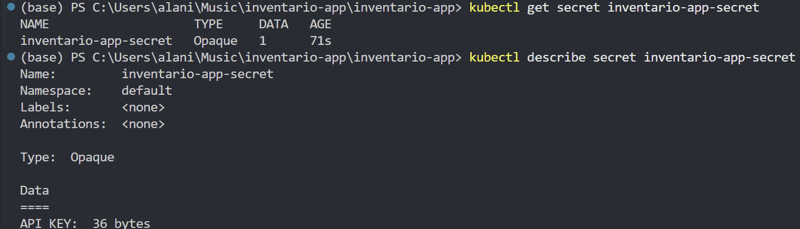

*Evidencia: el Secret contiene la clave `API_KEY`, pero el valor no se muestra en la salida.*

### Consumir el Secret desde los Deployments

En `blue-deployment.yaml` y `green-deployment.yaml`:

```yaml
- name: API_KEY
  valueFrom:
    secretKeyRef:
      name: inventario-app-secret
      key: API_KEY
```

`secretKeyRef` carga la credencial como variable de entorno sin escribir el valor en el manifiesto.

Aplicar y verificar:

```powershell
kubectl apply -f k8s/blue-green/blue-deployment.yaml
kubectl apply -f k8s/blue-green/green-deployment.yaml

kubectl rollout status deployment/cicd-practica-sd-blue
kubectl rollout status deployment/cicd-practica-sd-green
```

Comprobar que la variable existe sin mostrarla:

```powershell
$BLUE_POD = kubectl get pods `
  -l "app=cicd-practica-sd-bg,track=blue" `
  -o jsonpath="{.items[0].metadata.name}"

kubectl exec $BLUE_POD -- sh -c 'test -n "$API_KEY"'

if ($LASTEXITCODE -eq 0) {
  Write-Host "API_KEY cargada correctamente en Blue"
}
```

La misma comprobación se puede repetir para Green cambiando el selector a `track=green`.

Comprobar que no existe un archivo versionado con la credencial:

```powershell
Get-ChildItem k8s -Recurse -File |
  Where-Object { $_.Name -match "secret|api.key|env" }

git status --short
```

No debe aparecer ningún archivo como `.env`, `secret.yaml`, `api-key.txt` o `patch.json`.

---

## Componente 2. Readiness con arranque lento

### Código de `server.js`

La aplicación lee el tiempo configurado:

```javascript
const startupDelayValue = Number.parseInt(
  process.env.STARTUP_DELAY_SECONDS || '0',
  10
);

const STARTUP_DELAY_SECONDS =
  Number.isFinite(startupDelayValue) && startupDelayValue > 0
    ? startupDelayValue
    : 0;

const STARTED_AT = Date.now();
```

La ruta `/health` devuelve `503` mientras la aplicación está iniciando:

```javascript
app.get('/health', (req, res) => {
  const elapsedSeconds = Math.floor(
    (Date.now() - STARTED_AT) / 1000
  );

  if (elapsedSeconds < STARTUP_DELAY_SECONDS) {
    return res.status(503).json({
      status: 'starting',
      reason: 'la aplicación todavía está iniciando',
      elapsedSeconds,
      startupDelaySeconds: STARTUP_DELAY_SECONDS
    });
  }

  if (SIMULATE_FAILURE || !db.canAccessDb()) {
    return res.status(500).json({
      status: 'error',
      reason: 'fallo simulado o base de datos no accesible'
    });
  }

  return res.status(200).json({ status: 'ok' });
});
```

### Prueba local

```powershell
npm test
```

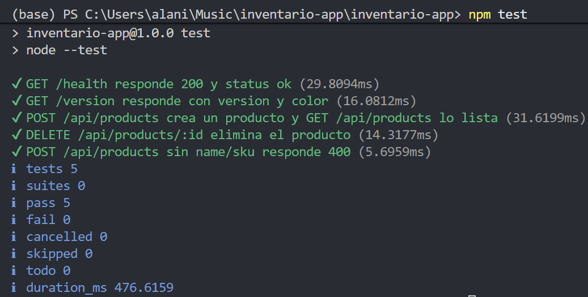

*Evidencia: el cambio conserva las cinco pruebas aprobadas.*

Iniciar con 30 segundos de retraso:

```powershell
$env:STARTUP_DELAY_SECONDS = "30"
$env:PORT = "3003"
npm start
```

En otra terminal:

```powershell
curl.exe -i http://localhost:3003/health
Start-Sleep -Seconds 31
curl.exe -i http://localhost:3003/health
```

La primera respuesta debe ser `503 Service Unavailable`. La segunda debe ser `200 OK`.

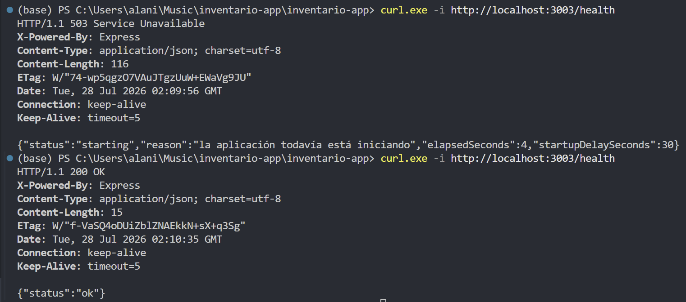

*Evidencia: `/health` informa que la aplicación aún no está lista y después cambia a estado saludable.*

Limpiar las variables locales:

```powershell
Remove-Item Env:STARTUP_DELAY_SECONDS
Remove-Item Env:PORT
```

### Configuración en Blue y Green

```yaml
- name: STARTUP_DELAY_SECONDS
  value: "30"
```

Readiness:

```yaml
readinessProbe:
  httpGet:
    path: /health
    port: 3000
  initialDelaySeconds: 2
  periodSeconds: 3
  timeoutSeconds: 1
  failureThreshold: 12
  successThreshold: 1
```

Liveness:

```yaml
livenessProbe:
  httpGet:
    path: /health
    port: 3000
  initialDelaySeconds: 40
  periodSeconds: 10
  timeoutSeconds: 1
  failureThreshold: 3
```

El readiness no elimina el pod. Cuando falla, el pod permanece ejecutándose, pero no recibe tráfico. El liveness sí puede reiniciar el contenedor, por eso comienza después de los 30 segundos de arranque simulado.

### Evidencia en Kubernetes

Terminal 1:

```powershell
kubectl get pods `
  -l "app=cicd-practica-sd-bg,track=green" `
  -w
```

Terminal 2:

```powershell
kubectl apply -f k8s/blue-green/green-deployment.yaml
kubectl rollout status deployment/cicd-practica-sd-green
```

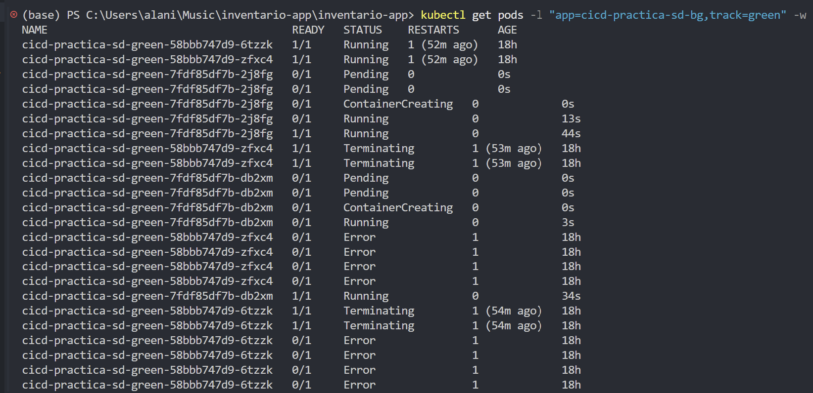

*Evidencia: los pods pasan de `0/1 Running` a `1/1 Running` sin reinicios.*

### ¿Por qué no basta con aumentar las réplicas?

Aumentar las réplicas no corrige una sonda mal configurada. Todas las réplicas pueden permanecer no listas durante el mismo periodo o reiniciarse si el liveness comienza demasiado pronto. Esto aumenta el consumo de CPU y memoria, pero no soluciona la causa.

Las réplicas aportan capacidad y redundancia. Las sondas determinan cuándo un pod está realmente preparado para recibir tráfico.

---

## Componente 3. Escaneo de seguridad con Trivy

Trivy analiza la imagen antes de su publicación. La configuración principal es:

**archivo `ci-cd.yml`**
```yaml
- name: Escanear vulnerabilidades CRITICAL con Trivy
  uses: aquasecurity/trivy-action@v0.36.0
  with:
    scan-type: image
    image-ref: ${{ env.REGISTRY }}/${{ env.IMAGE_NAME }}:${{ github.sha }}
    format: table
    scanners: vuln
    severity: CRITICAL
    exit-code: '1'
```

- `severity: CRITICAL` limita el control a vulnerabilidades críticas.
- `exit-code: '1'` detiene el job si Trivy encuentra una vulnerabilidad crítica.
- Los pasos de login y `docker push` están después del escaneo, por lo que una imagen rechazada no se publica.

### Error real detectado

El primer escaneo encontró una vulnerabilidad crítica en:

```text
/usr/local/lib/node_modules/npm/node_modules/tar
```

Versión detectada:

```text
7.5.11
```

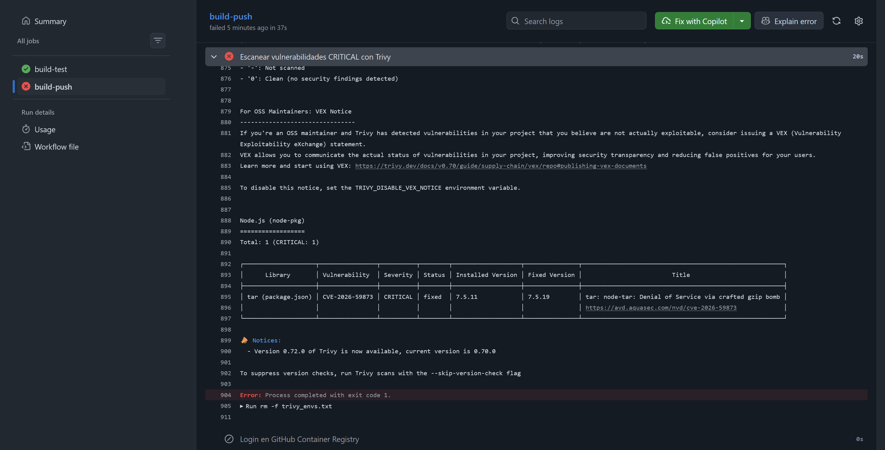

*Evidencia: Trivy encontró una vulnerabilidad `CRITICAL` y detuvo `build-push` antes de la publicación.*

La aplicación no necesita `npm` en tiempo de ejecución. Por eso se eliminó de la etapa `runtime` del Dockerfile:

```dockerfile
RUN npm ci --omit=dev \
    && npm cache clean --force \
    && rm -rf /usr/local/lib/node_modules/npm \
    && rm -f /usr/local/bin/npm /usr/local/bin/npx
```

Comprobar localmente la corrección:

```powershell
docker build --no-cache -t inventario-app:trivy-fix .

docker run --rm inventario-app:trivy-fix sh -c "if [ ! -f /usr/local/lib/node_modules/npm/node_modules/tar/package.json ]; then echo 'tar vulnerable eliminado correctamente'; else exit 1; fi"
```

Después se subió el cambio:

```powershell
git add Dockerfile
git commit -m "Eliminar npm vulnerable de la imagen runtime"
git push origin main
```

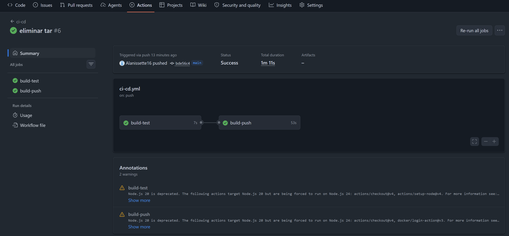

*Evidencia: después de corregir la imagen, las pruebas, Trivy y la publicación finalizaron correctamente.*

---

# Verificación final

Ejecutar:

```powershell
kubectl get deployments
kubectl get pods -l app=cicd-practica-sd-bg -L track
kubectl get services
kubectl get secret inventario-app-secret
```

Comprobar las imágenes activas:

```powershell
kubectl get deployment cicd-practica-sd-blue `
  -o jsonpath="{.spec.template.spec.containers[0].image}"

Write-Host ""

kubectl get deployment cicd-practica-sd-green `
  -o jsonpath="{.spec.template.spec.containers[0].image}"

Write-Host ""
```

## Problemas reales encontrados y solución

| Problema | Causa | Solución |
|---|---|---|
| Nombre de imagen inválido | GHCR exige nombres en minúsculas | Se definió `IMAGE_NAME: alanissette16/practica_cicd`. |
| Permiso denegado al publicar | El job no tenía permiso de escritura en Packages | Se agregó `packages: write`. |
| Error con el parche JSON | PowerShell interpretó incorrectamente las comillas | Se creó un archivo temporal `patch.json` y se usó `--patch-file`. |
| Trivy detuvo el pipeline | `npm` global contenía `tar 7.5.11` vulnerable | Se eliminó `npm` y `npx` de la imagen final. |

